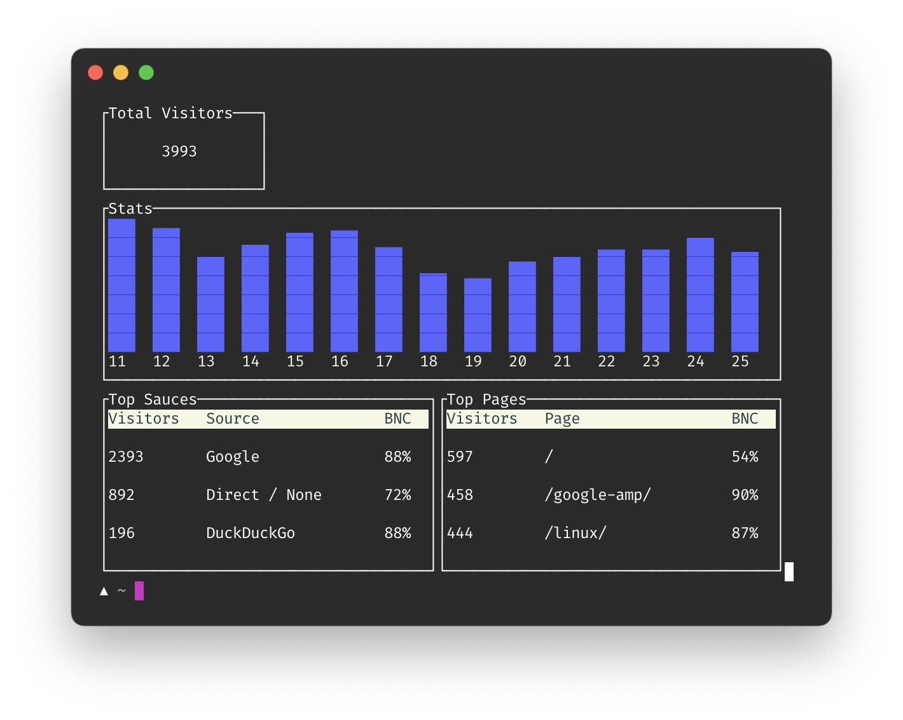

# Conclusive

Conclusive. A command line client for 
[Plausible Analytics](https://plausible.io).

 \
*(thanks to Marko from Plausible.io for providing me a demo account to take this screenshot!)*


## Building

Clone this repository, `cd` into it on a terminal and build the binary:

```sh
cargo build --release
```

You will find the binary at `./target/release/conclusive`.


## Usage

In order to use `conclusive` you need to [create an 
API token](https://plausible.io/settings#api-keys) in your 
Plausible.io account.

Then export your API token as environment variable named `PLAUSIBLE_TOKEN`.

```sh
export PLAUSIBLE_TOKEN=YOUR-PLAUSIBLE-API-TOKEN
conclusive -p 30d YOUR-WEBSITE
```

For more further options check `conclusive -h`.
